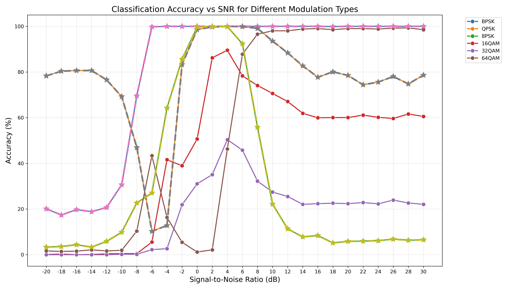
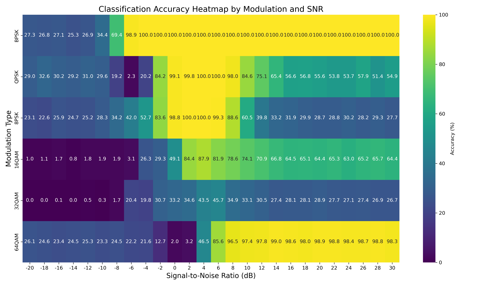

# AMC Notebook - Automatic Modulation Classification using Deep Learning


## Overview

This repository contains a Jupyter notebook-based implementation of Automatic Modulation Classification (AMC) using deep learning techniques. AMC is a crucial component in cognitive radio systems and spectrum monitoring applications, enabling the automatic identification of modulation schemes from received radio signals.

The project focuses on CNN-based approaches with comprehensive dataset exploration and performance analysis tools.

## Table of Contents

- [Features](#features)
- [Requirements](#requirements)
- [Installation](#installation)
- [Dataset](#dataset)
- [Usage](#usage)
- [Model Architecture](#model-architecture)
- [Results](#results)
- [Project Structure](#project-structure)
- [Contributing](#contributing)
- [Future Work](#future-work)
- [References](#references)
- [License](#license)

## Features

- **Interactive Jupyter Notebooks** for exploratory research and development
- **Multiple CNN Architectures** including standard CNN and Deep CNN (DDCNN) implementations
- **Comprehensive Dataset Analysis** with dedicated exploration notebooks
- **Signal Energy Analysis** for understanding modulation characteristics  
- **Training Visualization** with saved training history plots
- **Model Checkpointing** with best model preservation (`best_model.pt`)
- **Performance Monitoring** through accuracy heatmaps and subplot analysis
- **Modular Design** with separate Python classes for different CNN architectures
- **Cross-Framework Support** with both TensorFlow and PyTorch implementations
- **Reproducible Research** through well-documented notebook workflows

## Requirements

- Python 3.8 or higher
- PyTorch
- h5py 
- NumPy
- SciPy
- Matplotlib
- Scikit-learn
- Pandas
- Seaborn

## Installation

1. Clone the repository:
```bash
git clone https://github.com/alfreita/AMC_notebook.git
cd AMC_notebook
```

2. Create a virtual environment:
```bash
python -m venv amc_env
source amc_env/bin/activate  # On Windows: amc_env\Scripts\activate
```

3. Install dependencies:
```bash
pip install jupyter tensorflow torch torchvision numpy scipy matplotlib seaborn pandas scikit-learn
```

4. Launch Jupyter Notebook:
```bash
jupyter notebook
```

## Dataset

This project works with radio frequency signal datasets for modulation classification. The `dataset_explorer.ipynb` and `exploredataset.ipynb` notebooks provide comprehensive analysis of the dataset characteristics.

### Data Exploration Features

- **Signal Analysis**: Energy distribution and characteristics
- **Modulation Types**: Focus on BPSK, 8PSK, and other digital modulations  
- **Visualization**: Comprehensive plots and statistical analysis
- **Quality Assessment**: Dataset stability and consistency checks

### Data Preparation

Use the dataset exploration notebooks to understand your data:
```bash
# Open Jupyter and run
jupyter notebook dataset_explorer.ipynb
```

The notebooks include:
- Signal preprocessing pipelines
- Data quality analysis  
- Modulation type distribution
- Energy exploration and signal characteristics

## Usage

### Getting Started

This project is primarily notebook-based for interactive research and experimentation. Here are the key notebooks to explore:

#### Main Notebooks
- **`main.ipynb`** - Primary project notebook with complete workflow
- **`CNN_model.ipynb`** - Main CNN implementation for AMC
- **`CNN2.ipynb`** - Enhanced CNN model version
- **`Improved_CNN2.ipynb`** - Latest improvements to CNN architecture

#### Dataset Analysis
- **`dataset_explorer.ipynb`** - Comprehensive dataset analysis and visualization
- **`exploredataset.ipynb`** - Additional dataset exploration
- **`energy_exploration.ipynb`** - Signal energy analysis and characteristics

#### Model Development
- **`tf_amc_test1.ipynb`** - TensorFlow implementation tests
- **`test2.ipynb`** - Model testing and validation

### Quick Start

1. **Explore the Dataset**: Start with `dataset_explorer.ipynb` to understand your data
2. **Train CNN Models**: Use `CNN_model.ipynb` or `Improved_CNN2.ipynb` for training
3. **Analyze Results**: Check the generated PNG files for performance visualizations

### Using the CNN Classes

```python
# Import the CNN class
from CNN_class import CNNClassifier  # or from DDCNN_class import DDCNNClassifier

# Initialize model
model = CNNClassifier(num_classes=11, input_shape=(128, 2))

# Load best trained model
model.load_state_dict(torch.load('best_model.pt'))

# Make predictions
predictions = model(input_data)
```

## Model Architecture

### CNN-based Classifier

The default CNN architecture consists of:
- Input layer for I/Q samples (128 × 2)
- Multiple convolutional layers with ReLU activation
- Batch normalization and dropout for regularization
- Global average pooling
- Dense layers for classification

### LSTM-based Classifier

For temporal sequence modeling:
- Bidirectional LSTM layers
- Attention mechanism
- Dense output layer with softmax activation

### Hybrid CNN-LSTM

Combines spatial and temporal feature extraction:
- CNN layers for local feature extraction
- LSTM layers for temporal dependencies
- Feature fusion and classification head

## Results

### Current Performance

Based on recent training results:

| Model             | Configuration            | Accuracy | Notes                                        |
|------------------|--------------------------|----------|----------------------------------------------|
| CNN              | Initial Training          | ~60.9%   | Stable training achieved                     |
| Improved CNN2    | Enhanced Architecture     | TBD      | Under development                            |
| DDCNN            | Deep CNN                  | TBD      | Experimental                                 |
| Transformer       | Full-scale Transformer    | TBD      | Uses self-attention for global dependencies  |
| Tiny Transformer | Lightweight Transformer   | TBD      | Optimized for low-power edge devices         |


### Training Progress Visualizations





The repository includes several performance visualization files:
- `CNN_NET_training_history.png` - CNN training curves
- `DDCNN2D_training_history.png` - Deep CNN training progress  
- `modulation_accuracy_heatmap.png` - Classification accuracy heatmap
- `modulation_accuracy_subplots.png` - Detailed accuracy analysis
- `all_modulations_accuracy.png` - Overall performance across modulation types 

### Supported Modulation Types

Currently tested and implemented:
- **BPSK** (Binary Phase Shift Keying)
- **8PSK** (8-Phase Shift Keying)
- Additional modulation types under investigation

## Project Structure

```
AMC_notebook/
├── 📁 __pycache__/                    # Python cache files
├── 📁 improvement_notebook/           # Model improvement experiments
├── 📄 CNN2.ipynb                     # CNN implementation v2
├── 📄 CNN_NET_training_history.png   # Training visualization
├── 📄 CNN_class.py                   # CNN class implementation
├── 📄 CNN_model-Copy1.ipynb          # CNN model backup/variant
├── 📄 CNN_model.ipynb                # Main CNN model notebook
├── 📄 DDCNN2D_training_history.png   # Deep CNN training history
├── 📄 DDCNN_class.py                 # Deep CNN class implementation
├── 📄 Improved_CNN2.ipynb            # Enhanced CNN implementation
├── 📄 Untitled-checkpoint.ipynb      # Checkpoint notebook
├── 📄 Untitled.ipynb                 # Experimental notebook
├── 📄 all_modulations_accuracy.png   # Accuracy visualization
├── 📄 best_model.pt                  # Best trained model weights
├── 📄 dataset_explorer.ipynb         # Dataset analysis and exploration
├── 📄 energy_exploration.ipynb       # Signal energy analysis
├── 📄 constellation.ipynb            # Explore BPSK constellation with newer approach 
├── 📄 exploredataset.ipynb          # Dataset exploration notebook
├── 📄 main.ipynb                     # Main project notebook
├── 📄 modulation_accuracy_heatmap.png # Performance heatmap
├── 📄 modulation_accuracy_subplots.png # Detailed accuracy plots
├── 📄 multiple_two_differentsource.py # Multi-source comparison
├── 📄 test2.ipynb                    # Test notebook v2
├── 📄 test_model_function.py         # Model testing functions
├── 📄 tf_amc_test1.ipynb            # TensorFlow AMC implementation
└── 📄 README.md                      # Project documentation
```

## Contributing

Contributions are welcome! Please follow these steps:

1. Fork the repository
2. Create a feature branch (`git checkout -b feature/new-feature`)
3. Commit your changes (`git commit -am 'Add new feature'`)
4. Push to the branch (`git push origin feature/new-feature`)
5. Create a Pull Request

### Development Guidelines

- Follow PEP 8 style guidelines
- Write unit tests for new features
- Update documentation for API changes
- Ensure all tests pass before submitting PR

## Future Work

- [ ] Implement transformer-based architectures
- [ ] Add support for more modulation types
- [ ] Develop real-time SDR integration
- [ ] Optimize models for edge deployment
- [ ] Add adversarial robustness evaluation
- [ ] Implement few-shot learning capabilities
- [ ] Create web-based demonstration interface

## References

1. Kong, W., Jiao, X., Xu, Y., & Yang, Q. (2025). An effective masked Transformer model for automatic modulation recognition. IEEE Transactions on Cognitive Communications and Networking.

2. Kong, W., Jiao, X., Xu, Y., & Yang, Q. (2025). An effective masked Transformer model for automatic modulation recognition. IEEE Transactions on Cognitive Communications and Networking.
   
3. Ma, W., Cai, Z., & Wang, C. (2024). A Transformer and convolution-based learning framework for automatic modulation classification. IEEE Communications Letters, 28(6), 1392–1396.
   
4. Huynh-The, T., Hua, C. H., Pham, Q.-V., & Kim, D.-S. (2020). MCNet: An efficient CNN architecture for robust automatic modulation classification. IEEE Communications Letters, 24(4), 811–814.

6. P, D., Das, D., & Bora, P. K. (2020). Dense layer dropout based CNN architecture for automatic modulation classification. 2020 IEEE Conference on Signal Processing, Computing and Control (ISPCC).

7. Abdulkarem, A. M., Abedi, F., Ghanimi, H. M. A., et al. (2022). Robust automatic modulation classification using convolutional deep neural network based on scalogram information. Computers, 11(11), 162.

8. Pu, X., Luo, C., Yin, Y., Liu, Z., & Luo, Y. (2024). Chromosomal mutation-inspired radio augmentation for enhanced automatic modulation classification. IEEE Internet of Things Journal, 11(24), 41124–41136.

9. Rajendran, S., Meert, W., Giustiniano, D., Lenders, V., & Pollin, S. (2018). Deep learning models for wireless signal classification with distributed low-cost spectrum sensors. IEEE Transactions on Cognitive Communications and Networking, 4(3), 433–445.

10. Chandhok, S., Joshi, H., Darak, S. J., & Subramanyam, A. V. (2020). LSTM guided modulation classification and experimental validation for sub-Nyquist rate wideband spectrum sensing. 2020 IEEE International Symposium on Dynamic Spectrum Access Networks (DySPAN).

11. Chandhok, S., Joshi, H., Darak, S. J., & Subramanyam, A. V. (2020). LSTM guided modulation classification and experimental validation for sub-Nyquist rate wideband spectrum sensing. 2020 IEEE International Symposium on Dynamic Spectrum Access Networks (DySPAN).

12. Huynh-The, T., Pham, Q.-V., Nguyen, T.-V., Nguyen, T. T., Ruby, R., Zeng, M., & Kim, D.-S. (2021).
Automatic modulation classification: A deep architecture survey. IEEE Access, 9, 142950–142973.

## Acknowledgments

- RadioML team for providing benchmark datasets
- GNU Radio community for signal processing tools
- TensorFlow/PyTorch teams for deep learning frameworks

---

**Note**: This project is currently under active development. Some features may be incomplete or subject to change.
